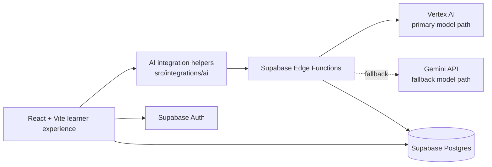
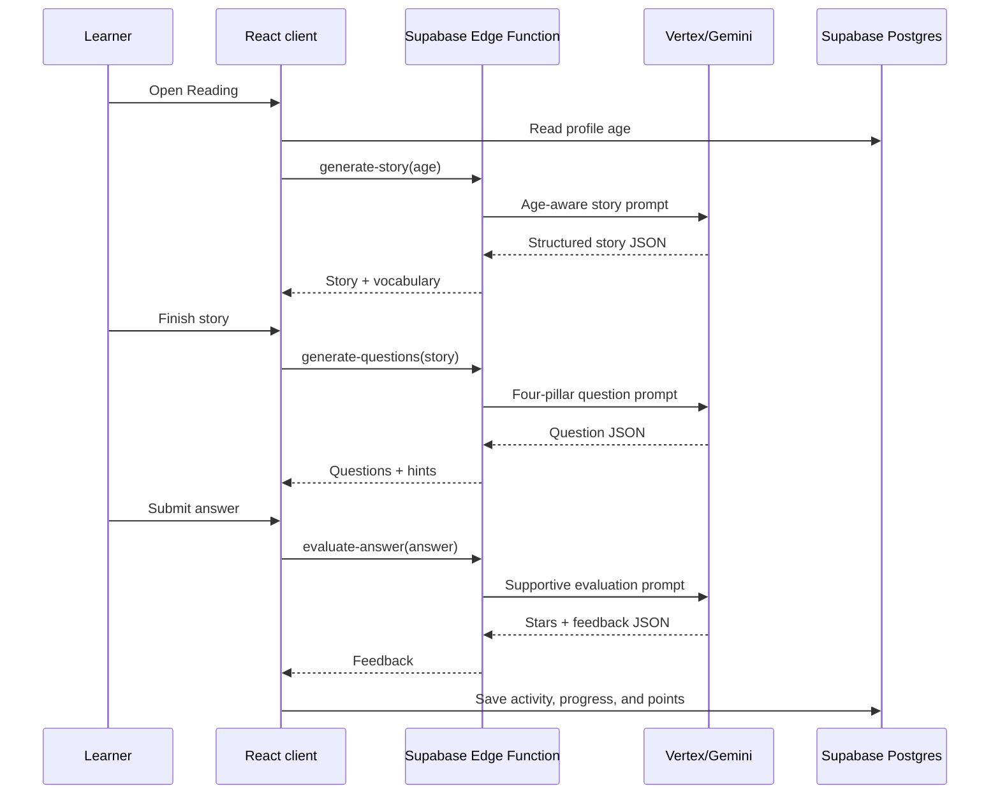

# Pilas con la Lectura! — Octavio

Pilas con la Lectura! is an AI-assisted reading and critical-thinking platform for children. Its Spanish-first experience combines short stories, guided comprehension, age-aware practice, gamified progress, and a friendly AI companion called Octavio the capybara.

The project is designed around a practical educational challenge in Colombia: many elementary students have limited access to personalized reading support. Octavio uses generative AI to create age-aware learning material and encouraging feedback, while Supabase stores identity, progress, activities, and rewards.

> This repository contains a working prototype. Some AI Edge Functions and parts of the database schema are deployed outside this repository; the integration details and current limitations are documented below.

## Why this project exists

The product targets children who are developing reading comprehension and critical-reading skills, especially learners in approximately grades 2–5. It aims to make practice feel approachable and repeatable:

- Content is generated in Spanish and shaped for a learner's age.
- Activities are organized around four critical-reading pillars: interpretation, inference, reflection, and argumentation.
- Octavio gives hints and supportive feedback instead of simply revealing an answer.
- Stars, points, levels, streaks, and achievements provide visible motivation.
- Local fallback content keeps several activities usable when an AI request fails.

## Product experience

### 1. Welcome and account access

The welcome screen introduces the product and Octavio. Users can create an account or sign in with a username and age. Supabase Auth manages the session, and the client keeps the session in browser storage.

### 2. Reading diagnosis

The onboarding diagnosis presents three short comprehension prompts with optional hints. The current UI stores completion in `sessionStorage` and routes the learner to the menu. The database contains a typed `diagnostic_results` table, but the current diagnosis page does not yet persist a scored diagnostic result or call an AI model.

### 3. Main menu

The authenticated menu exposes four missions:

| Mission | Purpose | Route |
| --- | --- | --- |
| Read a Magical Story | AI-generated reading and comprehension session | `/reading` |
| Game Challenge | Practice interpretation, sequencing, vocabulary, and inference | `/games` |
| Secret Daily Challenge | AI-generated daily practice with feedback | `/daily-challenge` |
| My Treasures | Points, progress, streaks, levels, and achievements | `/progress` |

The menu also shows a suggested activity from Octavio. The current suggestion is fixed UI copy; it is not yet computed from learner history.

### 4. AI-guided reading session

The reading flow is the core learning loop:

1. Read the learner's age from the Supabase profile.
2. Generate an original story with age-appropriate language, a positive theme, reading-time estimate, and one vocabulary word.
3. Present the story and its vocabulary definition.
4. Generate exactly four questions across the four critical-reading pillars.
5. Let the learner request hints before submitting an answer.
6. Evaluate the answer with supportive, child-friendly feedback.
7. Award stars and save the completed activity, reading time, and points to Supabase.

The four pillars are:

| Pillar | Learning question | Typical activity |
| --- | --- | --- |
| Interpretation | What does the text say? | Main idea, literal comprehension, event order |
| Inference | What does the text imply? | Motives, implicit meaning, predictions |
| Reflection | What do I think? | Personal connections and opinions |
| Argumentation | How can I justify it? | Evidence-based explanations and perspectives |

### 5. AI-powered games

The games screen requests practice material from the `games` Edge Function and falls back to local examples when needed. It includes:

- Reading comprehension with multiple-choice questions.
- Sequence ordering with five events.
- Vocabulary in context.
- Inference questions based on a short text.

Correct answers add points to the learner's profile. The game integration also defines support for hints and other challenge modes for future expansion.

### 6. Daily challenges

Daily challenges are generated through the tutor integration and can be multiple-choice or open-ended. They are labeled with one of the four critical-reading pillars. The learner receives AI-generated feedback, an explanation, encouragement, and a star score.

The current UI allows up to four completed challenges per user per day and stores completions in the `daily_challenges` table with a uniqueness rule per user, date, and pillar.

### 7. Progress and motivation

The progress screen reads the learner's profile, progress record, and achievements. It displays:

- Stories completed.
- Total stars/points.
- Unlocked achievements.
- Current reading streak.
- Current level and progress toward the next level.

## AI architecture

The browser never needs to hold Vertex AI or Gemini secrets. It sends structured requests to Supabase Edge Functions, which build prompts, call a model, validate the response, and return JSON to the React client.



### AI capabilities implemented in the client

| Capability | Client entry point | Backend contract |
| --- | --- | --- |
| Octavio hints/chat | `src/integrations/ai/octavio.ts` | Direct `POST` to `octaviobot` |
| Story generation | `generateStory()` in `src/integrations/ai/tutor.ts` | `books` with `mode: "generate-story"` |
| Critical-reading questions | `generateQuestions()` | `books` with `mode: "generate-questions"` |
| Answer evaluation | `evaluateAnswer()` | `books` with `mode: "evaluate-answer"` |
| Daily challenge generation and feedback | `askTutor()` | `daily-challenge-two` |
| Game content and hints | `askGames()` in `src/integrations/ai/games.ts` | Direct `POST` to `games` |

### Prompt and output design

The checked-in `supabase/functions/story-generator/index.ts` contains the reference implementation for the story/question/evaluation contract:

- Stories are generated in Spanish and grouped by age: up to 8, 9–11, and over 11.
- Target story lengths are 200–300, 300–400, and 400–500 words respectively.
- The prompt selects a theme and vocabulary word appropriate for the age group.
- Question generation asks for exactly four questions: two multiple-choice questions for interpretation and inference, followed by open-ended reflection and argumentation questions.
- Each question includes at least two hints.
- Answer evaluation returns `isCorrect`, `stars`, `feedback`, `explanation`, and `encouragement`.
- Multiple-choice answers receive 3 stars when correct and 1 star for an incorrect attempt. Open-ended answers receive 1–3 stars based on coherence, reflection, and clarity.
- The function requests JSON and includes parsing and validation safeguards for model output.

### Model fallback strategy

`story-generator` tries Vertex AI first and falls back to the Gemini API when Vertex is unavailable or not configured. The frontend also includes local fallback stories, questions, exercises, and hints in the games flow so a transient AI error does not necessarily end the activity.

### Important function-name note

The repository includes the source for an Edge Function named `story-generator`, while the current reading client invokes a deployed function named `books`. The project therefore expects the connected Supabase project to already provide `books`, `daily-challenge-two`, `games`, and `octaviobot`.

Before deploying from a clean environment, choose one of these approaches:

1. Deploy or maintain a `books` function whose contract matches `tutor.ts`.
2. Rename/adapt the checked-in `story-generator` function and update `src/integrations/ai/tutor.ts` to invoke the deployed name.

Do not assume that the checked-in function is automatically available under `books`.

## Tech stack

- React 18 and TypeScript.
- Vite for development and production builds.
- React Router for application routes.
- Tailwind CSS with a custom tropical visual theme.
- Radix UI and shadcn-style components for accessible UI primitives.
- Supabase Auth, Postgres, and Edge Functions.
- Vertex AI and Gemini-compatible generation endpoints for AI content.
- Vercel-compatible SPA rewrite configuration in `vercel.json`.

## Repository structure

```text
.
├── src/
│   ├── components/          # Shared UI, including the Octavio assistant bubble
│   ├── integrations/
│   │   ├── ai/              # Typed clients for the AI Edge Functions
│   │   └── supabase/        # Supabase client and generated database types
│   ├── pages/               # Welcome, auth, diagnosis, reading, games, etc.
│   ├── assets/              # Octavio illustrations and background art
│   └── main.tsx             # App bootstrap and global background setup
├── supabase/
│   ├── functions/           # Edge Function source currently tracked here
│   └── migrations/          # SQL migrations currently tracked here
├── public/                  # Static files
├── index.html               # SPA document metadata and font loading
├── package.json             # Scripts and dependencies
├── tailwind.config.ts       # Design tokens and Tailwind extensions
└── vercel.json              # SPA fallback rewrite for deployment
```

## Local setup

### Prerequisites

- Node.js 18 or newer is recommended.
- npm.
- A Supabase project with Auth, the required tables, and the AI Edge Functions available.
- Vertex AI and/or Gemini credentials for server-side AI generation.

### Install and run

```bash
git clone https://github.com/bysergr/octavio-s-platform.git
cd octavio-s-platform
npm install
npm run dev
```

The Vite server is configured for `http://localhost:8080`.

This repository does not currently include `.env.example`. Create `.env.local` manually if needed:

```dotenv
VITE_SUPABASE_URL=https://your-project.supabase.co
VITE_SUPABASE_PUBLISHABLE_KEY=your-supabase-publishable-key
VITE_SUPABASE_PROJECT_ID=your-project-id
```

Only the Supabase URL and publishable key are required by `src/integrations/supabase/client.ts`. `VITE_SUPABASE_PROJECT_ID` is useful project metadata but is not currently read by that client.

Never put service-account JSON, private keys, Vertex tokens, or Gemini API keys in a `VITE_*` variable or in browser code.

### Available scripts

| Command | Purpose |
| --- | --- |
| `npm run dev` | Start the Vite development server on port 8080 |
| `npm run build` | Create a production build |
| `npm run build:dev` | Create a development-mode build |
| `npm run preview` | Preview the production build locally |
| `npm run lint` | Run ESLint |

## Supabase and AI configuration

### Database

The tracked migration creates the `daily_challenges` table and indexes. The generated database types and current pages also reference these tables:

- `profiles` — learner name, age, level, avatar, and total points.
- `user_progress` — stories, reading time, games, daily challenges, streaks, and reading level.
- `reading_activities` — completed reading sessions, scores, and time spent.
- `daily_challenges` — daily challenge answers, pillar, stars, and completion date.
- `achievements` — unlocked rewards.
- `diagnostic_results` — the typed destination for scored diagnosis data.

Only `daily_challenges` is created by the SQL migration currently checked into this repository. For a new Supabase project, create or import the remaining schema before opening authenticated routes.

### Server-side secrets for `story-generator`

Configure secrets in the Supabase Edge Function environment, not in the frontend:

| Variable | Required | Description |
| --- | --- | --- |
| `VERTEX_PROJECT_ID` | For Vertex AI | Google Cloud project ID |
| `VERTEX_LOCATION` | Optional | Defaults to `us-central1` |
| `VERTEX_MODEL` | Optional | Defaults to `gemini-1.5-flash` for the Vertex path |
| `VERTEX_ACCESS_TOKEN` | Alternative | Pre-created Vertex access token |
| `GOOGLE_SERVICE_ACCOUNT_JSON` | Alternative | Service-account JSON for token exchange |
| `GOOGLE_CLIENT_EMAIL` | Alternative | Service-account email when using split credentials |
| `GOOGLE_PRIVATE_KEY` | Alternative | Service-account private key when using split credentials |
| `GOOGLE_TOKEN_URI` | Optional | Defaults to Google's OAuth token endpoint |
| `GEMINI_API_KEY` | Fallback | Gemini API key |
| `GEMINI_MODEL` | Optional | Defaults to `gemini-2.5-flash-lite` |

For Vertex authentication, use either `VERTEX_ACCESS_TOKEN`, `GOOGLE_SERVICE_ACCOUNT_JSON`, or the `GOOGLE_CLIENT_EMAIL` + `GOOGLE_PRIVATE_KEY` pair. The Gemini key is needed if the fallback path should be available.

### Deploying Edge Functions

The exact deployment process depends on the Supabase project and CLI setup. The general flow is:

```bash
supabase login
supabase link --project-ref your-project-id
supabase db push
supabase functions deploy story-generator
```

The deployed functions consumed by the current frontend must also exist:

```text
books
daily-challenge-two
games
octaviobot
```

The `games` and `octaviobot` clients currently contain the Supabase function URL directly in source code. If the application moves to another Supabase project, update those integrations or centralize the function base URL before deploying.

## Data flow for a reading session



## Development notes and production considerations

This is an educational prototype, especially in its handling of identity and child data. Before production use, address the following:

- The current auth flow derives a synthetic email and password from the username and age. Replace this with a secure, consent-aware identity flow before using real child accounts.
- Define guardian/teacher consent, data retention, moderation, and age-appropriate AI safety policies.
- Add server-side authorization and row-level security checks for every learner-owned table.
- Persist and score the diagnosis, then use it to drive level selection and recommendations.
- Make the menu recommendation depend on progress instead of fixed copy.
- Align the checked-in `story-generator` source with the deployed `books` contract, or rename the client call.
- Add automated tests for AI response validation, fallback behavior, data writes, and critical-reading scoring.
- Review AI-generated stories and feedback for hallucinations, bias, reading level, and cultural appropriateness.
- Add a `LICENSE` file if the project is intended for redistribution; no license is currently included.

## Contributing

1. Create a feature branch.
2. Keep AI prompts and response contracts typed and documented.
3. Add or update a migration for schema changes.
4. Run the checks before opening a pull request:

   ```bash
   npm run lint
   npm run build
   ```

5. Describe any changes to prompts, model providers, Edge Function names, or database contracts in the pull request.

## License

No license has been declared yet. Contact the project maintainers before redistributing or using the code outside the repository.
